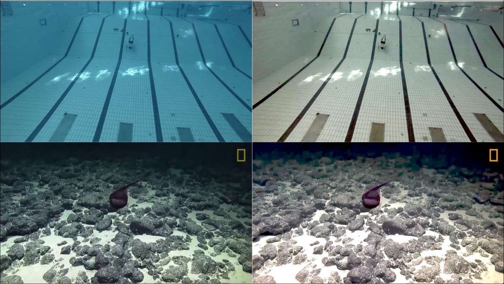
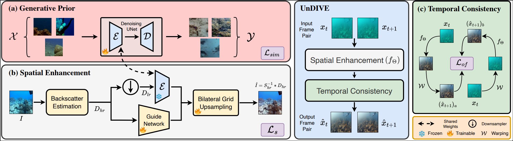

<div align="center">
<h1>UnDIVE</h1>
<h3>Generalized Underwater Video Enhancement Using Generative Priors</h3> 
  
[Suhas Srinath]()<sup>1</sup> [Aditya Chandrasekar]()<sup>2</sup> [Hemang Jamadagni]()<sup>3</sup> [Rajiv Soundararajan]()<sup>1</sup> [Prathosh A P]()<sup>1</sup> <br>
WACV 2025 ([conference paper](https://openaccess.thecvf.com/content/WACV2025/papers/Srinath_UnDIVE_Generalized_Underwater_Video_Enhancement_using_Generative_Priors_WACV_2025_paper.pdf)) ArXiv Preprint([arXiv 2411.05886](https://arxiv.org/pdf/2411.05886))
</div>

## Abstract
With the rise of marine exploration, underwater imaging has gained significant attention as a research topic. Underwater video enhancement has become crucial for real-time computer vision tasks in marine exploration. However, most existing methods focus on enhancing individual frames and neglect video temporal dynamics, leading to visually poor enhancements. Furthermore, the lack of ground-truth references limits the use of abundant available underwater video data in many applications. To address these issues, we propose a two-stage framework for enhancing underwater videos. The first stage uses a denoising diffusion probabilistic model to learn a generative prior from unlabeled data, capturing robust and descriptive feature representations. In the second stage, this prior is incorporated into a physics-based image formulation for spatial enhancement, while also enforcing temporal consistency between video frames. Our method enables real-time and computationally-efficient processing of high-resolution underwater videos at lower resolutions, and offers efficient enhancement in the presence of diverse water-types. Extensive experiments on four datasets show that our approach generalizes well and outperforms existing enhancement methods. <br><br>



## Overview


## Usage
For a help Menu <br>
Run ```python <filename> -h```
### Setup Environment
```bash
conda create -n undive -f environment.yml
conda activate undive
```
### Download Pretrain Model Weights
[Download](https://drive.google.com/file/d/1FP0wuYQX0t0of9gqDO_gyUiMK7UYXRG-/view?usp=sharing) the ZIP file and extract into `./PretrainedModels`<br><br>
      ```DDPM_100.pth``` : DDPM trained on [UIEB](https://li-chongyi.github.io/proj_benchmark.html) <br>
      ```UIEB_pretrain_150.pth``` : Pre-training on [UIEB](https://li-chongyi.github.io/proj_benchmark.html) <br>
      ```UnDIVE_100.pth``` : Model fine-tuned with temporal consistancy loss on [UVE-38k](https://github.com/TrentQiQ/UVE-38K).<br>
### Prepare Dataset
```
📂 Data/
│── 📂 Train/ 
│   ├── 📂 bsr_images/
│   │   ├── 📼 videos
|   |   |   ├── 🖼️ frames.png
│   ├── 📂 gt/
│   │   ├── 📼 videos
|   |   |   ├── 🖼️ frames.png
│   ├── 📂 backward_flow/
│   │   ├── 📼 videos
|   |   |   ├── 📂 high_flow/
|   |   |   |   ├── 🖼️ flow.npy
|   |   |   ├── 📂 low_flow/
|   |   |   |   ├── 🖼️ flow.npy
│   ├── 📂 forward_flow/
│   │   ├── 📼 videos
|   |   |   ├── 📂 high_flow/
|   |   |   |   ├── 🖼️ flow.npy
|   |   |   ├── 📂 low_flow/
|   |   |   |   ├── 🖼️ flow.npy
│── 📂 Image_Pretrain/
│   ├── 📂 bsr_images/
|   |   ├── 🖼️ frames.png
│   ├── 📂 gt/
|   |   ├── 🖼️ frames.png
│── 📂 Test/
│   ├── 📂 bsr_images/
│   │   ├── 📼 videos
|   |   |   ├── 🖼️ frames.png
```
### Backscatter Removal
```bash
python ./BackScatterRemoval/bsr.py --video-path <video_frames> --depthmap-path <depthmaps> --output-path <bsr_images>
```
### Optical Flows
Use [Fast Flow Net](https://github.com/ltkong218/FastFlowNet) to compute Optical Flows.<br>
Move the files ```./OpticalFlows/run_forward.py and ./OpticalFlows/run_backward.py``` to ```FastFlowNet/```<br>
Run ```OpticalFlows/get_flows.py```
```bash
python OpticalFlows/get_flows.py --orig-root <Train Data> --ffn-root <FastFlowNet> --flow-root <Output Flows>
```
### Generative Prior
#### Setup Environment
```bash
conda create -n undive_ddpm -f ./GenerativePrior/environment.yml
conda activate undive_ddpm
```
#### DDPM Training
```bash
python ./GenerativePrior/DDPM.py
```
#### DDPM Inference
```bash
python ./GenerativePrior/inference.py 
```
### Training
#### Image Pretraining
```bash
python UIEB_pretrain.py --image-data-path <image pretrain root> --test-video <test video root>
```
#### UnDIVE Training
```bash
python UIEB_pretrain.py --video-data-path <video pretrain root> --test-video <test video root>
```
### Inference
```bash
python inference.py --test-video <test video root>
```

## Citation
If you find UnDIVE useful in your research or applications, please consider giving us a star 🌟 and citing it using the following:

```bibtex
@InProceedings{Srinath_2025_WACV,
    author    = {Srinath, Suhas and Chandrasekar, Aditya and Jamadagni, Hemang and Soundararajan, Rajiv and A P, Prathosh},
    title     = {UnDIVE: Generalized Underwater Video Enhancement using Generative Priors},
    booktitle = {Proceedings of the Winter Conference on Applications of Computer Vision (WACV)},
    month     = {February},
    year      = {2025},
    pages     = {8983-8994}
}
}
